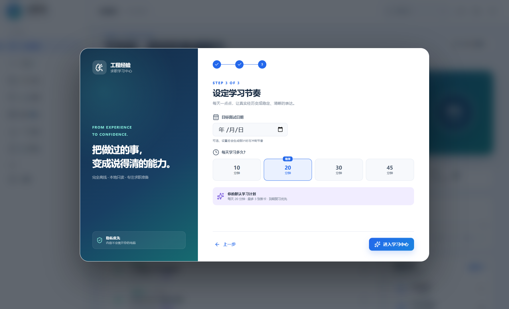
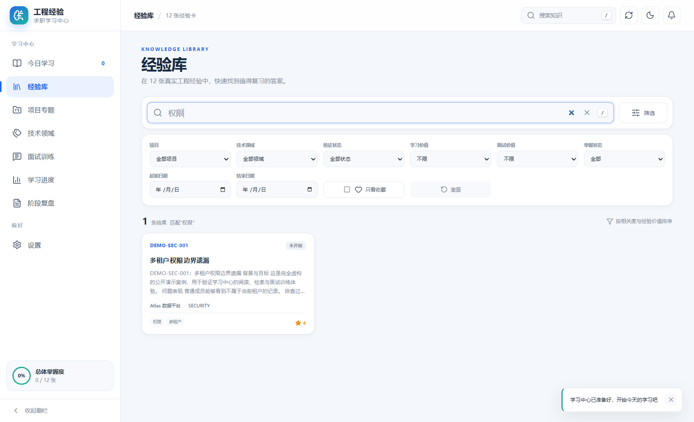
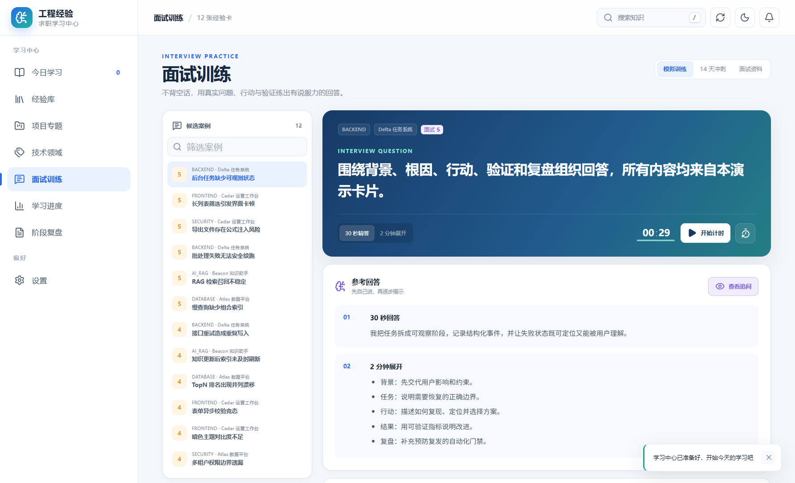
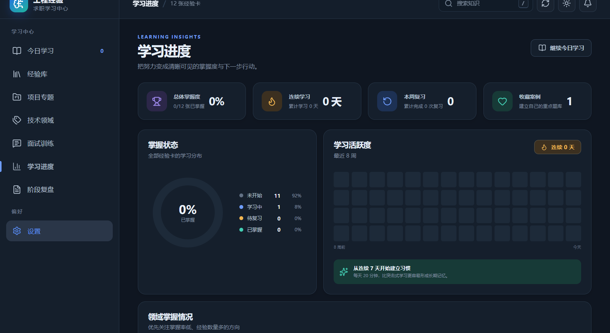

# Engineering Career Hub

[简体中文](README.zh-CN.md)

An offline Windows desktop app that turns your own engineering experience
cards into a focused study and technical-interview practice workspace.

Engineering Career Hub is designed for developers who already keep structured
project retrospectives but need a calmer way to search, review, remember, and
practice explaining them. It reads the knowledge base locally, never rewrites
source cards, and keeps notes and review progress in separate app data.

## Highlights

- **Interview preparation from real work** — practice existing questions,
  30-second answers, two-minute structures, and follow-ups without generated
  content.
- **Fast Chinese and mixed-language search** — search titles, body text,
  projects, domains, and tags, then filter by value, verification, mastery, and
  date.
- **Transparent spaced repetition** — six Leitner levels use intervals of
  today, 1, 3, 7, 14, and 30 days.
- **Readable long-form review** — structured sections, a content outline,
  collapsible evidence, adjustable text size, wide reading mode, and light or
  dark themes.
- **Private local learning state** — favorites, notes, confidence, history,
  and settings are stored separately and can be exported or imported as JSON.
- **Windows-native delivery** — current-user NSIS installer, desktop shortcut,
  Start menu entry, and 125%/150% scaling support.

## Product tour

### Search and filter the experience library

### Rehearse answers with a timer and progressive reveal

### See progress in light or dark mode

Every public screenshot is captured from the real application using a
synthetic E2E knowledge base. No personal project, card, note, local user path,
or credential appears in these images.

## Privacy and data boundary

| Area | Behavior |
| --- | --- |
| Knowledge base | Read-only access to the selected directory |
| Learning data | Stored under %APPDATA%\EngineeringExperienceStudyCenter |
| Network | No runtime API, telemetry, AI service, or update request |
| Renderer | Sandboxed; no direct Node.js or filesystem access |
| Markdown | Sanitized with a strict HTML allowlist |
| External links | Only HTTP/HTTPS links may be handed to the default browser |

The app scans only these folders:

- 01_原始经验卡片
- 02_项目经历索引
- 04_面试知识库
- 05_阶段复盘
- 06_待学习知识

Templates, system logs, receipts, and handoff files are excluded. Learning
actions never modify the knowledge base.

## Install on Windows

1. Open the [latest release](https://github.com/wyg916/Engineering-Career-Hub/releases/latest).
2. Download the x64 setup executable.
3. Verify the SHA256 value published in the release notes.
4. Run the installer. It installs for the current user and does not require
   administrator privileges.

PowerShell verification example:

~~~powershell
Get-FileHash .\Engineering-Experience-Study-Center-1.0.0-Setup.exe -Algorithm SHA256
~~~

The current installer is not commercially code-signed, so Windows may show an
unknown-publisher or reputation warning. Verify the checksum before running it.

## Connect a knowledge base

Discovery order:

1. The last directory selected in the app.
2. experience-recorder.json under CODEX_HOME.
3. experience-recorder.json under %USERPROFILE%\.codex.
4. A directory selected manually.

The selected root must contain the 01_原始经验卡片 directory. See the
[Chinese user guide](docs/使用说明.md) for the complete workflow.

## Develop and test

Requirements:

- Windows 10 or 11
- Node.js 24 or newer
- Corepack and pnpm 11.19.0

~~~powershell
corepack enable
corepack pnpm install --frozen-lockfile
corepack pnpm typecheck
corepack pnpm test
corepack pnpm test:e2e
~~~

Build the x64 current-user installer:

~~~powershell
corepack pnpm package:win
~~~

The Electron E2E suite creates a temporary, fictional knowledge base. It never
reads CODEX_HOME from the developer's machine and only writes public screenshots
when UPDATE_SCREENSHOTS=1 is explicitly set.

## Architecture

- src/core — Markdown/YAML parsing, weighted n-gram search, review scheduling
- src/main — Electron lifecycle, root discovery, file watching, validated IPC,
  and atomic local state
- src/preload — narrow renderer bridge
- src/renderer — React user interface
- tests — unit, negative, security-boundary, and Electron E2E coverage

See [CONTRIBUTING.md](CONTRIBUTING.md), [SECURITY.md](SECURITY.md), and the
[public validation report](docs/验收报告.md) before changing security or data
boundaries.

## Current limitations

- V1 supports Windows x64 only.
- The installer is unsigned.
- Automatic updates and startup-at-login are intentionally disabled.
- The app does not create, rewrite, or synchronize knowledge cards.
- The app does not contain an AI model and does not generate interview answers.

## License

Released under the [MIT License](LICENSE). See
[third-party notices](THIRD_PARTY_NOTICES.md) and
[asset provenance](docs/asset-provenance.md) for bundled dependencies and
public visual assets.

Engineering Career Hub is an independent open-source project. It is not
affiliated with, sponsored by, or endorsed by OpenAI. Codex and other product
names belong to their respective owners.
